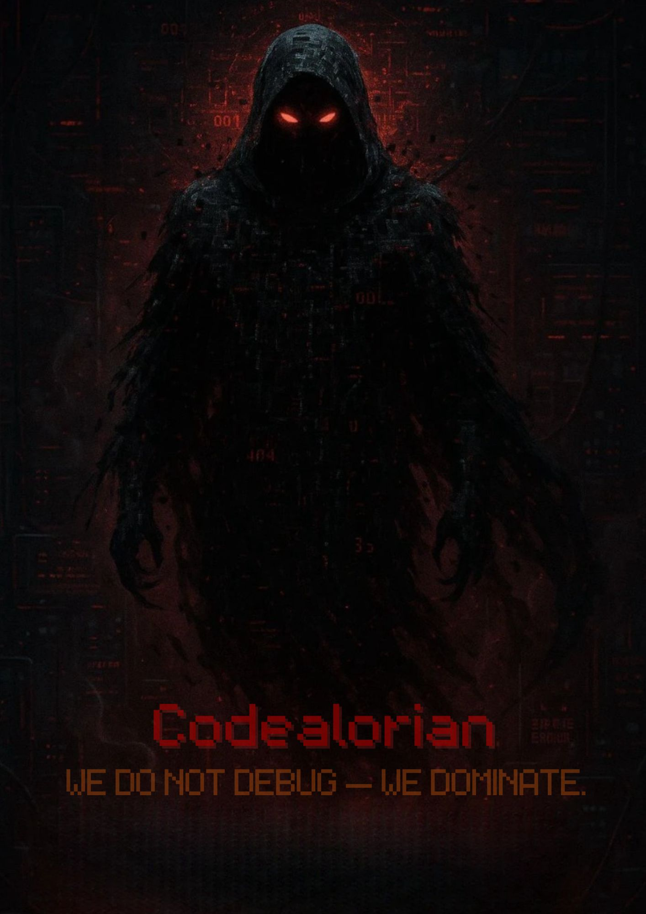

## 🧑‍🚀 Meet the Mascot

<p align="center">
  
</p>

> A loyal servant of the Dark Side — here to keep you productive and fully operational.


# 🛡️ Order 66 - Sith Productivity Website

> "Execute Order 66... and focus like a true apprentice of the Dark Side."

A Star Wars-themed, full-stack productivity timer app that transforms your focus sessions into an immersive Sith experience. Built with React, Node.js, and Socket.IO for real-time collaboration.

## 🎯 What is Order 66?

Order 66 is a gamified productivity application that combines the Pomodoro Technique with Star Wars Sith theming to create an engaging focus environment. Users complete 25-minute focus sessions (Pomodoros) to gain experience points, unlock Sith ranks, and build streaks while managing tasks and tracking progress.

## 🚀 Live Demo

**🌐 Live Website:** [Order 66 - Sith Productivity App](https://order66-exjs-git-main-abhinavs-projects-1c08a69a.vercel.app/)

## 🛠️ Tech Stack

### Frontend
- **React 19.1.0** - Modern UI framework with hooks
- **React Calendar** - Interactive calendar for task scheduling
- **Socket.IO Client** - Real-time communication
- **CSS3** - Custom Sith-themed styling with animations
- **Local Storage** - Persistent user data and progress

### Backend
- **Node.js** - Server runtime
- **Express.js** - RESTful API framework
- **Socket.IO** - Real-time bidirectional communication
- **CORS** - Cross-origin resource sharing

### Deployment
- **Vercel** - Backend/Frontend hosting

## 🏆 Chosen Track: **Full Stack**

This project demonstrates full-stack development capabilities with:
- Modern React frontend with real-time features
- Node.js backend with Socket.IO for live collaboration
- Responsive design and progressive web app features
- Real-time task synchronization across multiple users

## 🌍 Problem Statement

Modern productivity faces three major challenges:
1. **Procrastination** - Difficulty starting and maintaining focus
2. **Task Switching** - Constant context switching reducing efficiency
3. **Lack of Motivation** - No engaging feedback loop for sustained productivity

Order 66 solves these by:
- **Gamification** - Sith ranking system and XP progression
- **Immersive Design** - Star Wars theming for engagement
- **Real-time Collaboration** - Shared task management
- **Streak Tracking** - Daily habit formation
- **Focus Mode** - Distraction-free environment

## 💼 Business Model

### Freemium Model
- **Free Tier**: Basic Pomodoro timer, task management, streak tracking
- **Premium Features** (Future):
  - Advanced analytics and insights
  - Team collaboration features
  - Custom Sith themes and avatars
  - Export/import functionality
  - Priority support

### Monetization Strategy
- Premium subscription for advanced features
- Team/enterprise licensing
- API access for integrations
- Custom theme marketplace

## 🎖️ Bounties/Challenges Completed

### ✅ Core Features
- [x] **Pomodoro Timer** - 25-minute focus sessions with start/pause/reset
- [x] **Sith Ranking System** - XP-based progression (Acolyte → Emperor)
- [x] **Streak Tracking** - Daily completion tracking with visual indicators
- [x] **Task Management** - Add, complete, and delete tasks
- [x] **Real-time Collaboration** - Socket.IO-powered live task sync
- [x] **Calendar Integration** - Schedule tasks with React Calendar
- [x] **Focus Mode** - Fullscreen distraction-free environment
- [x] **Sith Theming** - Dark theme with red accents and animations
- [x] Easter Egg – Hidden modal with Jedi lore and quotes if you try to switch to the Light Side
- [x] Vercel Deployment – Deployed with CI/CD via Vercel for seamless updates and performance

### ✅ Advanced Features
- [x] **3D Walking Sith Character** - Animated mascot with walking cycles
- [x] **Sith Quotes Engine** - Random motivational quotes from Sith Lords
- [x] **Avatar System** - Unlockable Sith characters (Vader, Maul, Palpatine, etc.)
- [x] **Badge System** - Achievement tracking (First Pomodoro, Order 66, etc.)
- [x] **Yoda Easter Egg** - Hidden Jedi quotes for balance
- [x] **Local Storage Persistence** - User progress saved across sessions
- [x] **Responsive Design** - Mobile-friendly interface
- [x] **PWA Features** - Installable web app

### ✅ Technical Achievements
- [x] **Real-time Socket.IO Integration** - Live task synchronization
- [x] **React Hooks Implementation** - Modern state management
- [x] **CSS Animations** - Smooth transitions and effects
- [x] **Fullscreen API** - Distraction-free focus mode
- [x] **Progressive Web App** - Offline capabilities and app-like experience

## 🚀 Getting Started

### Prerequisites
- Node.js (v16 or higher)
- npm or yarn

### Installation

1. **Clone the repository**
   ```bash
   git clone https://github.com/your-username/order66.git
   cd order66
   ```

2. **Install frontend dependencies**
   ```bash
   cd frontend
   npm install
   ```

3. **Install backend dependencies**
   ```bash
   cd ../backend
   npm install
   ```

4. **Start the backend server**
   ```bash
   npm start
   # Server runs on http://localhost:5000
   ```

5. **Start the frontend development server**
   ```bash
   cd ../frontend
   npm start
   # App runs on http://localhost:3000
   ```

## 🎮 How to Use

1. **Start a Focus Session**: Click the "Execute Order 66" button to begin a 25-minute Pomodoro
2. **Manage Tasks**: Add tasks to your list and mark them complete
3. **Track Progress**: Watch your XP grow and unlock new Sith ranks
4. **Build Streaks**: Complete daily sessions to maintain your streak
5. **Collaborate**: Tasks sync in real-time across all connected users
6. **Schedule**: Use the calendar to plan future tasks

## 🔮 Future Enhancements

- [ ] **Mobile App** - React Native version
- [ ] **AI Integration** - Smart task suggestions and productivity insights
- [ ] **Team Features** - Shared workspaces and team analytics
- [ ] **Custom Themes** - Additional Star Wars character themes
- [ ] **Advanced Analytics** - Detailed productivity reports
- [ ] **Integration APIs** - Connect with Todoist, Notion, etc.
- [ ] **Voice Commands** - Sith-themed voice controls

## 🙏 Acknowledgments

- Star Wars universe for inspiration
- Pomodoro Technique for productivity methodology
- React and Node.js communities for excellent documentation
- Socket.IO for real-time capabilities

---

**May the Force be with your productivity!** ⚡

*"Through passion, I gain strength. Through strength, I gain power. Through power, I gain victory."*


